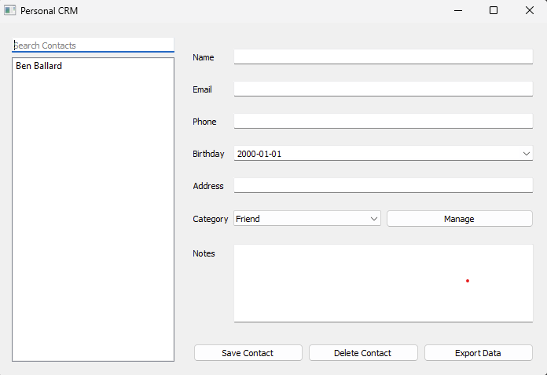

# Personal CRM

A desktop Personal Customer Relationship Management (CRM) application built with Python and PyQt5. This application allows users to manage their contacts, including features such as contact details, categorization, birthday reminders, and data import/export capabilities.



## Features

- Add, edit, and delete contacts
- Categorize contacts
- Search functionality
- Birthday reminders
- Data validation
- Import/Export contacts (JSON format)

## Installation

1. Clone the repository:
   ```
   git clone https://github.com/ballard11/personal-crm.git
   cd personal-crm
   ```

2. Install the required dependencies:
   ```
   pip install -r requirements.txt
   ```

## Usage

Run the application:
```
python main.py
```

## Contributing

Contributions are welcome! Please feel free to submit a Pull Request.

## License
This project is licensed under the MIT License - see the [LICENSE](LICENSE) file for details.
